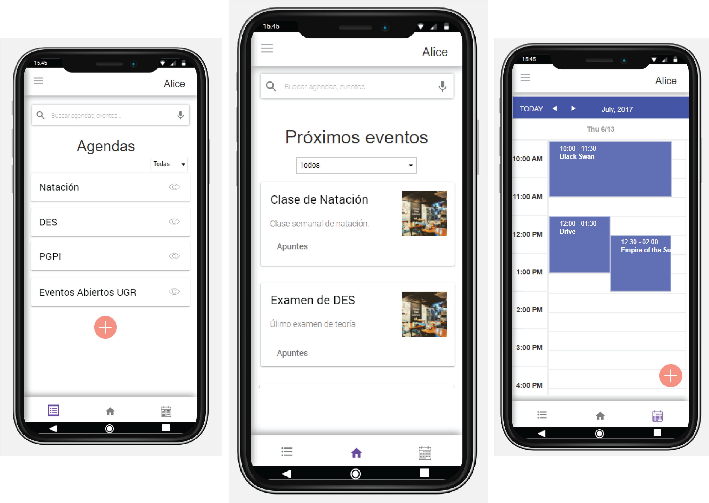
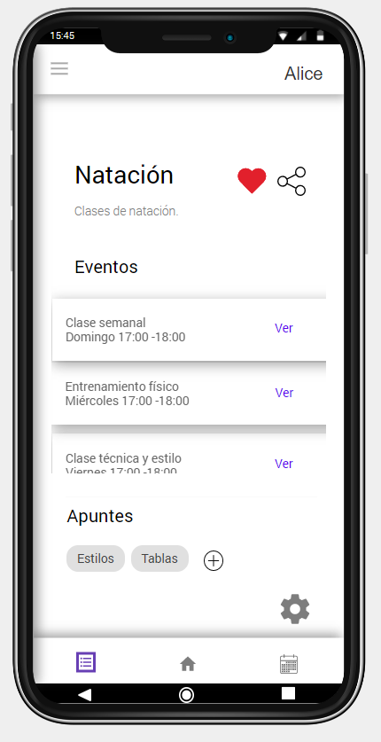
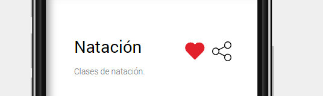
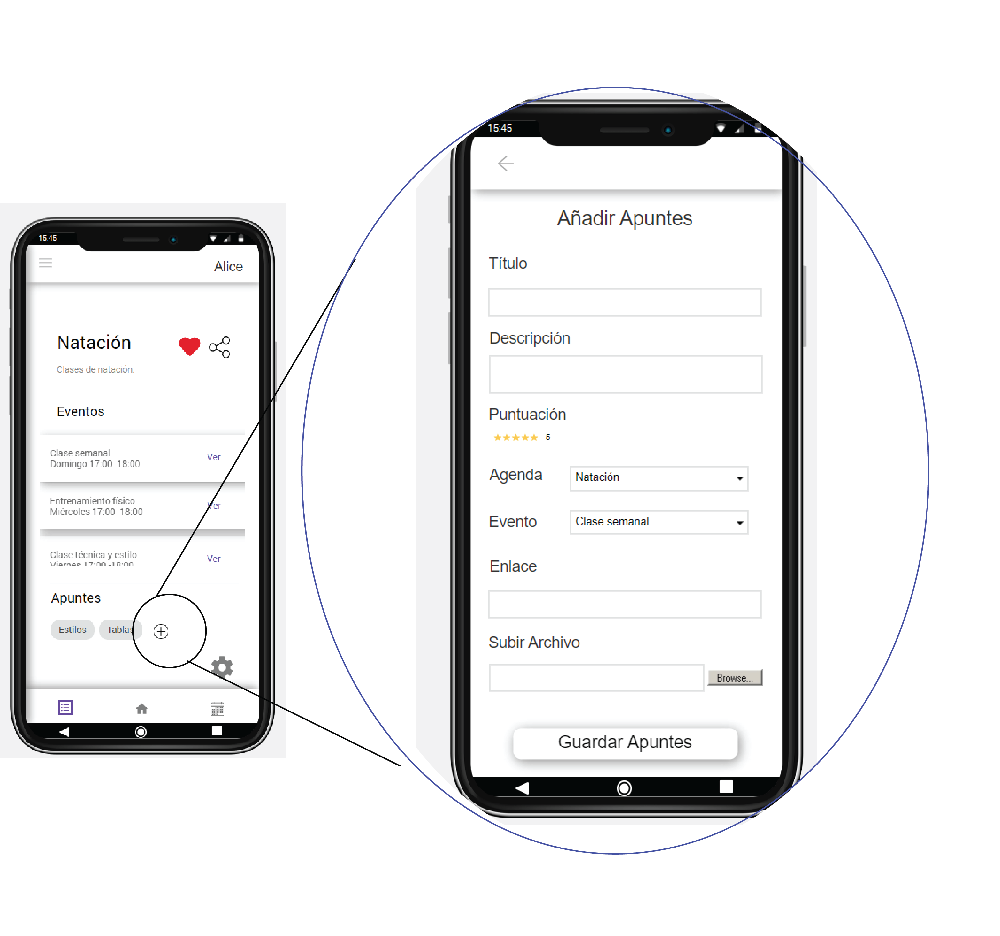
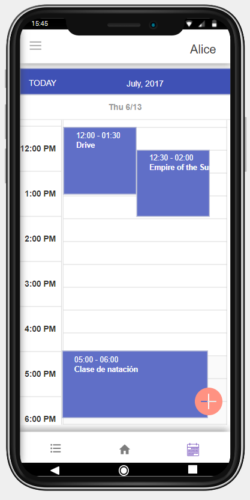

# ¡Bienvenido a Calendario Interactivo!

En esta app podrás tener todo bien organizado y no olvidarte de nada, asignaturas de la carrera, días de entreno en el gimnasio, tareas domésticas, ¡y todo lo que se te ocurra!

## Crea agendas y llénalas de eventos
Crear agendas personalizada para cada cosa, de este modo puedes decir adiós a las 5 agendas físicas que tienes en tu casa y que, cuando necesitas buscar algo, nunca sabes donde lo escribiste (ve pidiendo cita de nuevo al dentista que se te ha pasado...). En un vistazo podrás consultar las asignaturas del día, el club de lectura, ver hasta la lista de la compra en la agenda de tareas de casa. Si no haces la labadora la semana que te tocaba no le eches la culpa a nadie más que a tí, que ya tienes una app donde ver todas tus tareas.

## Comparte agendas con tus amigos
¿Tienes un club de parchís y siempre se te olvida que día habeís quedado para contarte veinte? Haz una agenda y compártela con todos los miembros, de ese modo todos estareis informados de qué día a que hora es la reunión. Además, será muy fácil cancelar un evento y que todos se enteren a tiempo.

## Añade archivos a las agendas para tenerlos siempre presentes 
Si, así es, esta es tu oportunidad de no tener esa asignatura perdida en 127 folios sin orden repartidos entre tu cajón, tu escritorio y la papelera. Tan solo adjuntalos y ya siempre estará disponibles y ordenados. 

## Comparte conocimiento y puntúalo
No dejes la oportunidad de compartir tu duro trabajo creando apuntes y compartelos con los compañeros. Además, podrás a su vez mejorar en tu estudio con los mejores apuntes de la comunidad. ¿Quieres ser el número uno y ser recordado por ayudar a aprobar a generaciones enteras?

## Observa de un vistazo como de agetreada tienes la semana
Entra en la vista de calendario y mira lo que te depara la semana. Podrás ver el calendario de una agenda, dos, o de las que quieras a la vez. Podrás saber fácilmente a que agenda pertenece cada evento por el color de cada agenda así como descubrir que huecos tienes para picar algo entre clase de violín y laboratorio de orgánica.

## Recibe notificaciones para que el trabajo no se te acumule
Empezamos el cuatrimetre bien, que tranquilito todo... pero... ¡Semana de exámenes! De pronto tienes que estudiar para 7 exámenes, hacer 16 prácticas y 32 ejercicios para entregar en dos días. Es hora de pensar que asignaturas dejarse para septiembre... En cambio, si recibes semana a semana avisos del cumplimiento de las fechas de trabajos, podrás ir haciéndolos poco a poco, y de este modo solo te tendrás que preocupar de estudiar para los exámenes y usar tu tiempo libre con los colegas, ¡Que chollo!
